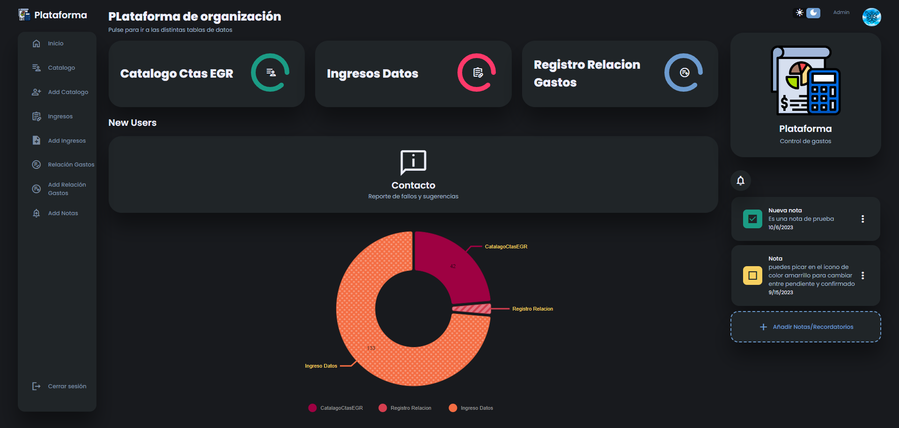
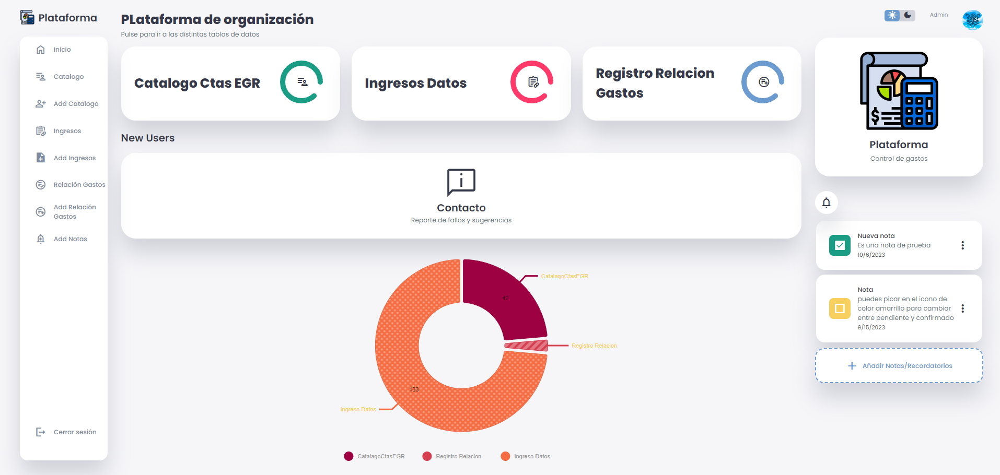
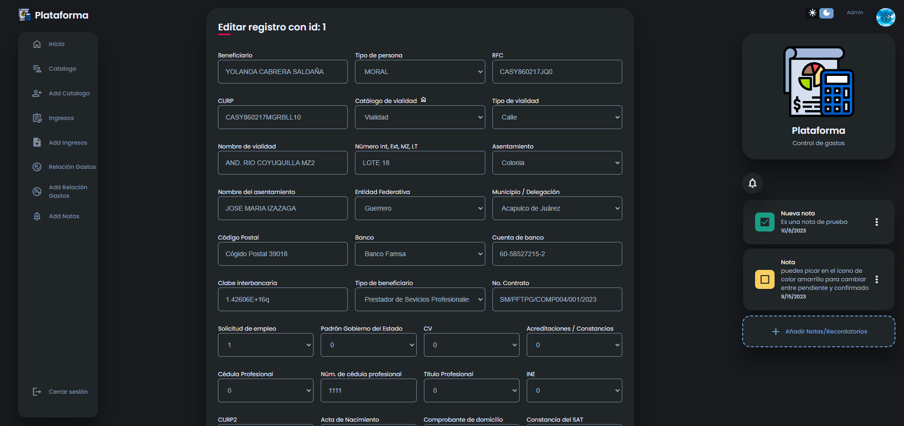
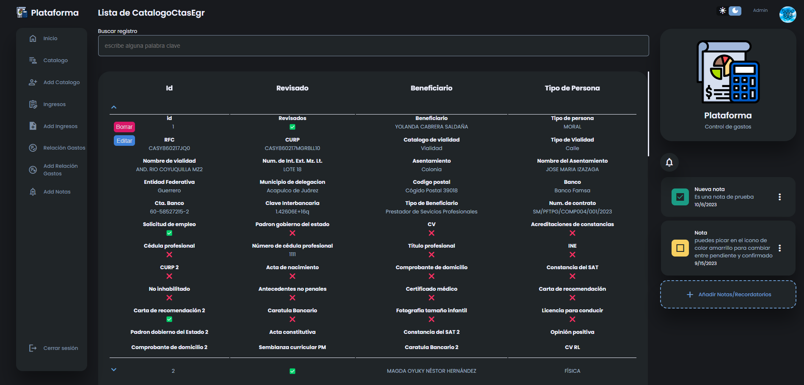

# Plataforma web para gestión de gastos

Es una plataforma web con frontend usando ReactJs, un API Rest con NodeJs y usando una base de datos MySQL. Esta alojada en un Hosting con su respectivo dominio

## 🌐Enlace al proyecto

(Suele tardar un poco al iniciar sesión pero ya se está arreglnaod:D)

[https://plataforma-palacio.com/](https://plataforma-palacio.com/)

## 🔗 Links

- [Correo✨](mailto:hectormancilla369@gmail.com)

- [WhatsApp✨](https://wa.me/7471096697)

## 📸Imagenes del proyecto:

